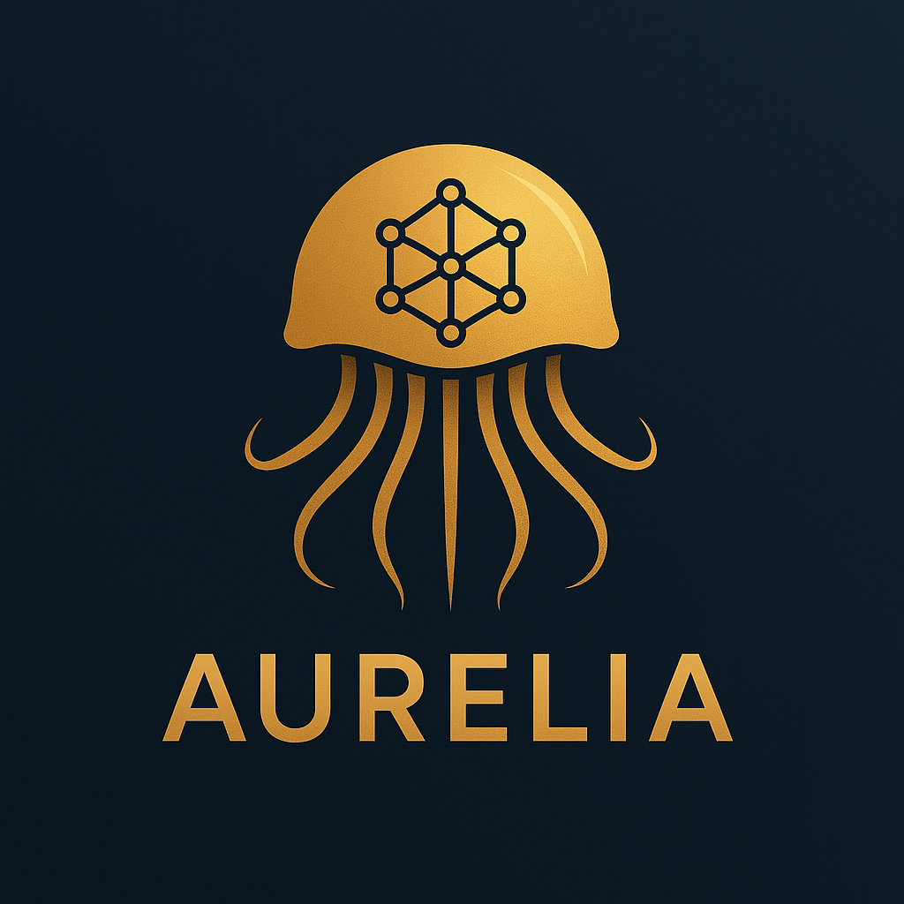

  

<h1 align="center">AURELIA</h1>

  <em>Align your conferencr for a negotiated future.</em>

---

# 🧱AURELIA
_Augmented United Resolution Environment with LLM and Interlinked Agents_

## 🧩Introduction

AURELIA is built as an experiment in improving how MUN delegates engage with topics — especially when it comes to forming and expressing positions. Rather than relying on formal position papers, delegates can now interact with an AI assistant to refine their stances and receive helpful feedback. Meanwhile, chairpersons and organizers can better understand the flow of committee dynamics.

> This system aims to support early-stage simulations and academic-level events, while remaining lightweight enough to deploy and customize without enterprise > > infrastructure.

---

## ✨Features

- **AI-guided Proposal Builder**
    Delegates can answer a few topic-relevant questions to generate early drafts of their ideas.
- **Procedural Assistant**
    Clear, rule-based support for motions, voting, and procedures.
- **Chair Dashboard**
    Overview of delegate responses and general position trends.
- **No Installations Required**
    Runs entirely on the web.
- **Multi-role Access System**
    Interfaces tailored for Chairs, Delegates, and Secretariat teams.
- **LLM-Driven Interactions**
    Cloud-based reasoning pipeline connects to a hosted model (can be replaced or customized).

---

## 🎯Use Case

Imagine a MUN conference where:
- Delegates join with no prior position paper.
- The chair poses a few key questions about the topic.
- Delegates respond conversationally, and the system guides them toward feasible stances.
- Chairs observe the ideological "landscape" and plan accordingly.
- Everyone accesses the platform via browser, no installations, no fuss.

---

## 🛠️Tech Stack

- Python + Flask for backend routing
- Gradio for quick UI prototyping
- OpenAI-compatible LLM API or other hosted inference engines
- RSA Key-Based Auth for restricted access testing
- (Planned) Weaviate or SQLite for lightweight session storage

---

## ⚖️License

This project is licensed under the Polyform Noncommercial License 1.0.0.
Free for academic, personal, or research use. Commercial usage requires separate permission.

---

## 🗒️Acknowledgements

Special thanks to open-source communities and Model UN organizers whose insights inspired this project.

Built with love — and too many committee sessions.

If you're a student, educator, or MUN enthusiast and want to contribute, feel free to open issues, suggest improvements, or fork the project!
